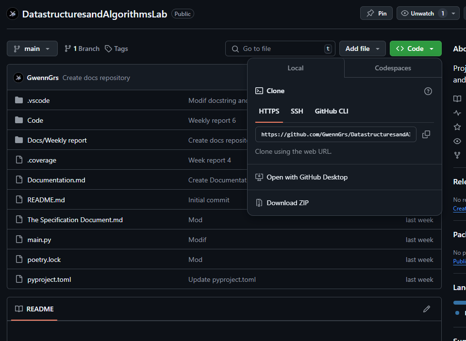
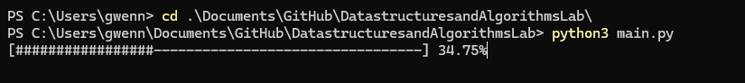
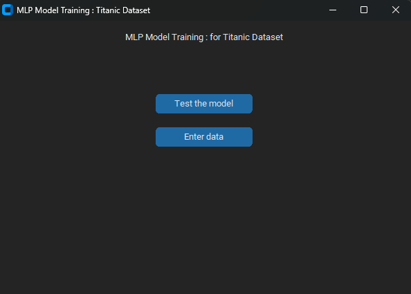

# User Guide
This user guide will help you understand and effectively use our project dedicated to multi-layer perceptron (MLP) neural networks, by providing you with detailed explanations of its operation and practical applications.

# Installation
## To install the project on your machine: 2 options

### Option 1
Go to the project's Github repository: https://github.com/GwennGrs/DatastructuresandAlgorithmsLab

Click on code and download the zip


*Capture from github*

Once the zip is downloaded, unzip it. _Example of software to unzip (Winrar, 7zip)_

### Option 2 
Use **Gitbash** :
_If you don't have Gitbash install it._

Use this command to clone it by first placing yourself in the desired folder.

```bash
git clone https://github.com/GwennGrs/DatastructuresandAlgorithmsLab.git 
```

Once the clone repository is positioned, position yourself inside.

```bash
cd DatastructuresandAlgorithmsLab
```
After this install the dependencies necessary for the project to work.

```bash 
poetry install
```
_It is possible that a problem occurs with scikit-learn because of Joblib, in this case do -pip install scikit-learn- in the terminal_
# Start the program
If everything is installed correctly and you are in the project folder, you can then launch the main program.

```bash
python3 main.py
```


_The execution of the program can be followed live in the executed console, before the interface appears._

# How to use it
## Appearance of the interface
Logically after a few seconds, an interface will appear with the model trained and ready for use.



_User interface_

### Test the model 
By clicking on test model, you will be able to see the accuracy percentage of the model applied on a test dataset _(found in /Code/input/titanic/test_fusion.csv)_.

### Enter data
The second button, enter the data, allows you to enter data in order to test the model.

#### Data format :
- **Pclass** : between 1 and 3 represents the passenger class _1 being the first, 3 the last_.
- **Sex** : male or female
- **Age** : integer
- **SibSp** : # of siblings / spouses aboard the Titanic
- **Parch** : # of parents / children aboard the Titanic
- **Fare** : Passenger fare
- **Embarked** : In which port the passenger will embark. _(C = Cherbourg, Q = Queenstown, S = Southampton)_.

Once the data is entered, return to the source interface and in front of the variable **Survived** you will see if the individual would have or did survive the Titanic.