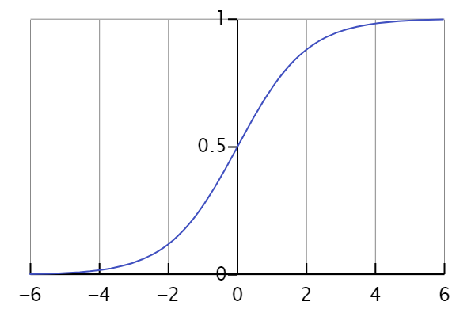

# 2nd Weekly report :

I start by implementing a simple neural network for the beginning. So that I can visualize how a single simple neuron works before implementing a full network.
*Source : https://www.youtube.com/watch?v=kft1AJ9WVDk&list=PLcTRC8diSLLB5ViyPGiwZfAi3t7bhwjQv*

## First python code:
I use numpy in order to have the mathematical elements necessary for the creation and functioning of the neuron.

### Sigmoid function:
It is used to introduce non-linearity into the model, which allows the neural network to better capture complex relationships in the data.

Works in a case of binarity.
We use fictitious input data, outputs and weights to test.

.T allows to put the array into a column vector.
Np.dot makes a scalar of my matrices.s
I calculate on paper to check my results.
The result is calculated according to the sigmoid function:
if I get -0.99999 the sigmoid function will return me 0.26.

*Figure 1/ Sigmoid fonction (Wikipédia)*

### Training process :
1.	Take the input for training and see the output.
2. Calculate the error / difference between what we got and what we wanted.
3. Depending on the severity of the error, readjust the weights.
4. Repeat
Adjust the weights by doing: error.input.’sigmoid(output)
Sigmoid() = 1/1+exp(-x) ---------- Sigmoid’() = x.(1-x)

Adjust the weights: adjustments = error * sigmoid_derivatives(outputs)

## Question
Why the sigmoid function?
Because the output will be normalized between 0 and 1, it allows a binary classification as well as a probabilistic interpretation of the result. The function is considered "smooth" which means that it varies continuously. This facilitates the adjustment of the weights gradually during the backpropagation phase.
*ref: https://www.sciencedirect.com/science/article/abs/pii/B9780323953993000081 (Chapter 2 - Fundamentals of neural networks)*

Why the derivative of the sigmoid function?
Why error * sigmoid'??

## Graphical interface
I used customtkinter to create a graphical window and saw how to enter inputs to use them with functions.
Using customtinker.
To implement my function in another file I must either modify the PATH or make a package.
## Using MLP for Iris Classification
I then looked at how people use pytorch to make a neural network to get an idea of ​​the structure for a classification method of this kind.
Dataset : https://www.kaggle.com/datasets/arshid/iris-flower-dataset

How to implement : https://www.youtube.com/watch?v=JHWqWIoac2I&t=95s

## For next week 
I would like to make a network using several neurons created individually and maybe use another method of creating neurons using something other than the sigmoid function.
Write the first tests and connect my interface to the other code.